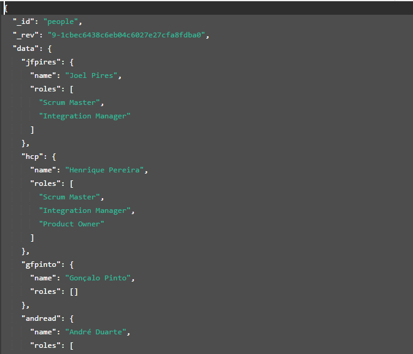
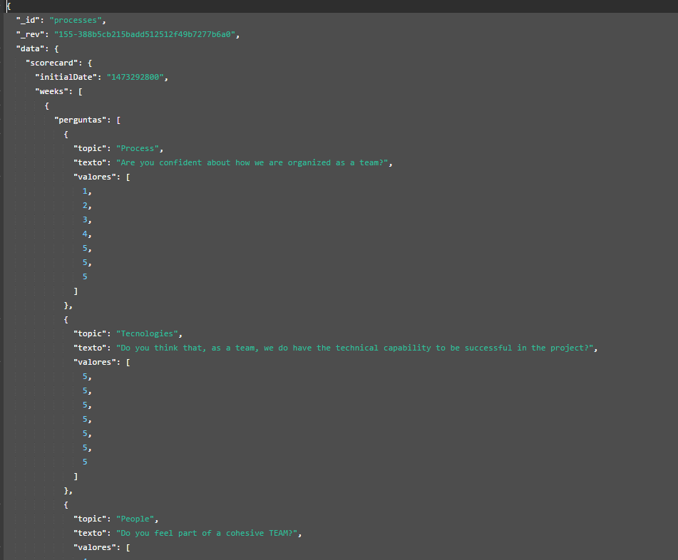

# gitDashboard
A Git web dashboard applied to our git project repository at [DEI Gitlab](https://git.dei.uc.pt)

## Members and Contacts of EdgeSoft  
- **Scrum Master:** Joel Pires, _jfpires@student.dei.uc.pt_  
- **Integration Manager:** Henrique Pereira,  _hcp@student.dei.uc.pt_
- **Product Owner:** André Duarte, _andread@student.dei.uc.pt_
- **Risk Manager:** João Costa, _jpfcosta@student.dei.uc.pt_
- **Developers:** Diana Pereira, Gonçalo Pinto, João Ferreiro

## Run the project:
- just run "index.html"

## Main Technologies
- HTML & CSS & Javascript
- couchDB (noSQL database)

## Requirements:
- **Install locally couchDB**
- **Download the folder "shards" and replace your local "couchDB/shards" folder by this one**
- Here's an example of the two tables that we are using:

  Table "people"

  
  
  
  Table "processes"  
  
  
  
  
  
  
  
  
  
  
